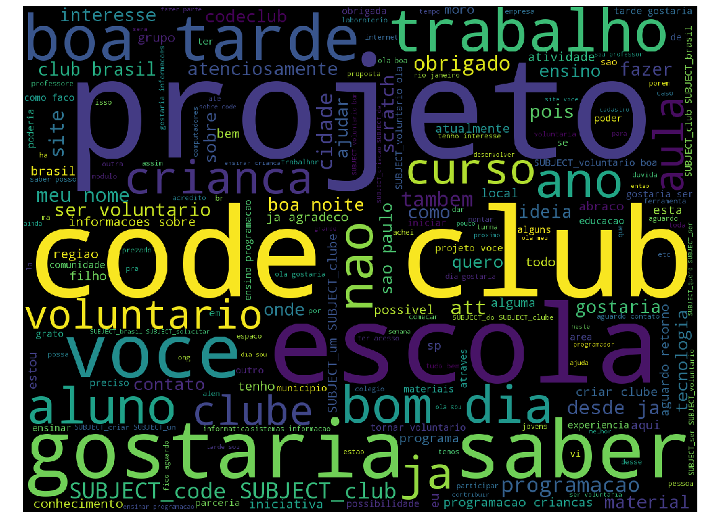
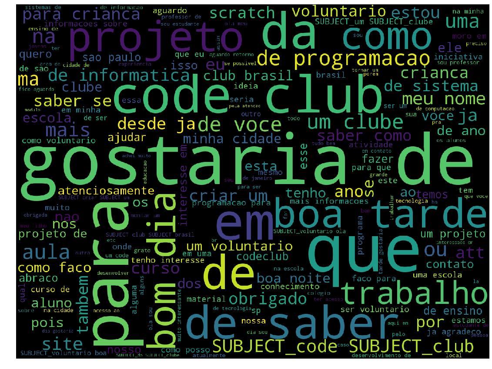
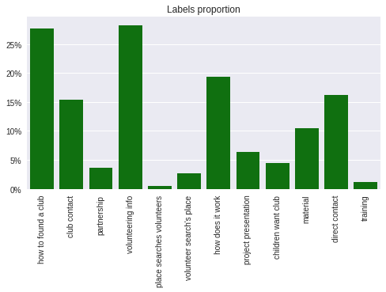
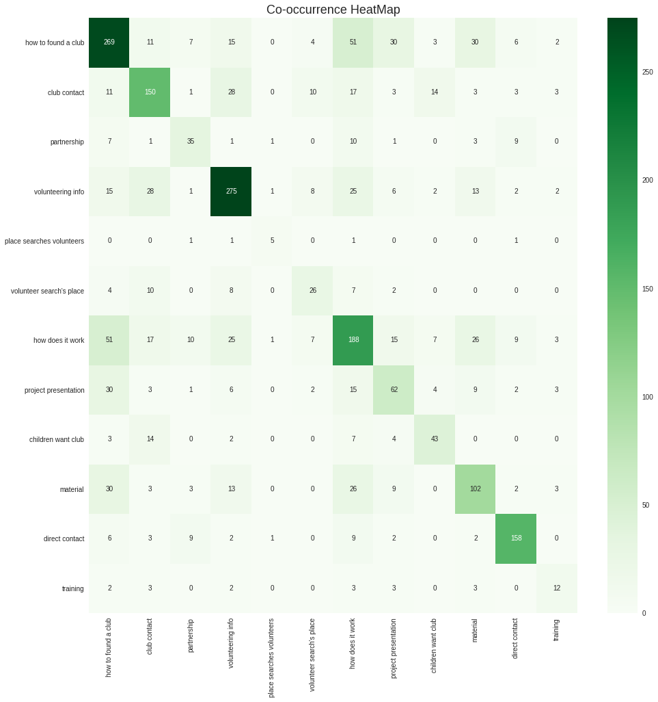

I worked as a volunteer coordinator for <a href="codeclubbrasil.org">Code Club Brazil</a> for 3 years. The most not-exciting part of it was about dealing with the e-mails, since they used to demand information that was available in our site, and, mainly, they would ask something really usual but each one in a different way, then every e-mail needed a lot of attention even if we usually used the same small set of already written answers.

So i decided to take a look at the data and see what could be done for it.

<div align="center">
<figure>
	<a href="images/word_cloud2.png">
		
	</a>
	<figcaption>Word Cloud.</figcaption>
</figure>
</div>

<!--  -->

1. [Data](#data)
2. [Exploratory Data Analysis](#exploratory)
3. [Reasoning about the problem](#problem)
4. [A simple model](#simple)
5. [Multi-label with binary relevance method](#binrelevance)
6. [Multi-label with a Classifier Chain](#chain)
7. [What about unsupervised learning?](#unsupervised)
8. [Conclusion](#conclusion)

### Data <a name="data"></a>
The data was collect from Code Club Brazil's e-mail inbox, totaling **972 messages**. The messages are all in brazilian Portuguese, eventually they will be translated to english for results presentation. E-mails from applications and social media weren't included. The dataset was organized with two text fields: subject and message. The other fields are manually assigned labels, being the presence of a label an indicator of a certain kind of doubt. We have **twelve of such labels**.

When we have multiple labels that can apply to a single example, we call it a **multi-label** problem. It's different than a multi-class problem, when classes are exclusive: a certain hand-written digit cannot be "1" and "3" at the same time, for example. But an e-mail can be modeled as something that contains one or more questions, one about subject A and another about B. 

Thoughts about which kind of problem it is and different ways of approaching it will be discussed later.

### Exploratory Data Analysis <a name="exploratory"></a>

Let's take a look into the data. First about the text and then about our manual labeling. 

After applying simple cleaning, like lower case and ponctuation exclusion, we analyse the **words frequency**. An ideia about it is given in the word cloud presented in the introduction. Now we show the ten most frequent word.

(top 10 frequent words)

It's expected that such kind of words be at the most frequent in texts. And it's a nice check to see them here. But we want to check for a more meaningful set, then we apply a tf-idf filter and check the top ten biggest scores:

(tf-idf top 10 image)


The <a href="https://en.wikipedia.org/wiki/T-distributed_stochastic_neighbor_embedding">**t-SNE**</a> (t-distributed stochastic neighbor embedding) is an algorithm for dimensionality reduction. In ML we usually use multi-dimension representations, in a sense that we can represent a word as a vector in \\( \mathbb{R}^{n} \\). For that we'll use the **word2vec** implementation from <a href="https://radimrehurek.com/gensim/">gensim</a> to build such vector space and then apply t-SNE to reduce its dimensions and visualize the word vectors distribution in a 2-dimension plot.

```python
from gensim.models import word2vec
from sklearn.manifold import TSNE

model = word2vec.Word2Vec(corpus, size=30, window=50, max_vocab_size=3000, workers=4)

for word in model.wv.vocab:
        tokens.append(model[word])
        labels.append((word.decode("utf-8")))
    
tsne_model = TSNE(perplexity=10, n_components=2, init='pca', n_iter=2500, random_state=23)
new_values = tsne_model.fit_transform(tokens)

```

The greater the window of our word2vec, the more closer words will share context instead of interchangeability. We can use the Word2Vec representation to check the words similarities. Inspecting the 5 most similar vectors for three words:

```python
model.most_similar("material")[:5]

```

<div style="display:none;"> 
<div align="center">
<figure>
	<a href="images/tsne.png">
		
	</a>
	<figcaption>t-SNE, click to open and visualize better.</figcaption>
</figure>
</div>

This graph shall reveal words similarities. Inspecting it and verifying that closer words are really similar, they present some interchangeability, usually appear in the same context and so on, is an evidence of our corpus quality, that our data is fine, consist of what we were expecting and can be used to feed a predictive model.
</div>
Now, we look to the labels. They were manually assigned and can help us to have an idea about the characteristics of our problem, but also to validate the labeling process and the early assumptions. 

<div align="center">
<figure>
	<a href="images/labels_proportion.png">
		
	</a>
	<figcaption>The twelve label types presence over the documents.</figcaption>
</figure>
</div>

It's easy to spot that some labels are really rare, though their subject is important for the project, like places and volunteers looking for each other to match and create a new club, or people asking about the volunteer training. The three main questions are **very related**. Some reasoning about the problem and the labeling process is needed before we go ahead.

<div align="center">
<figure>
	<a href="images/nlabels_email.png">
		
	</a>
	<figcaption>Number of labels in each document count.</figcaption>
</figure>
</div>

Most of our documents have only one label. None presented more than four of the questions defined as labels. We can count the co-occurrence of the labels to see how they relate with each other and where most of our problem (people's doubts) lies.

<div align="center">
<figure>
	<a href="images/co-occurrence.png">
		
	</a>
	<figcaption> As it's colored with an absolute comparison, we should care about darker squares.</figcaption>
</figure>
</div>

### Reasoning About the Problem <a name="problem"></a>

If someone ask you "What does Sin(x) mean?", you could certainly retrieve a high-school math book as an answer and hope the person will search there until he finds the exactly information he was looking for. In Code Club e-mails we could also make a text or redirect to our FAQ every doubt received, but how boring it's to consider volunteering and still have to invest a lot of your time to just find out how? 

So we want to retrieve exactly what people want to know about the project, but we also do not want to allocate a lot of coordination effort on it. Considering it'd be very hard to predict correctly every e-mail, we should put our attention in the largest labels and try to solve the maximum of our problem without having to put much complexity on it.

The labeling process was run with the assumption, built over my own perception about the main subjects present in e-mails, that many types of questions were made in each e-mail and they use to differ about the set  composition. Our visualizations here show that the main part of the problem seems simpler than expected, and that we should be able to capture a great part of the solution value aiming a few questions. So we'll apply multiple approaches:

1. Transform the problem in a binary classification, trying different combinations of labels for both classes. (use just e-mail subject!)
2. Build a single classifier for each label and apply all of them to decide which answers should compose the response.
3. Let the information from each classifier help the others and construct a classifier-chain

### The simplest model we could use

The subject of an e-mail
